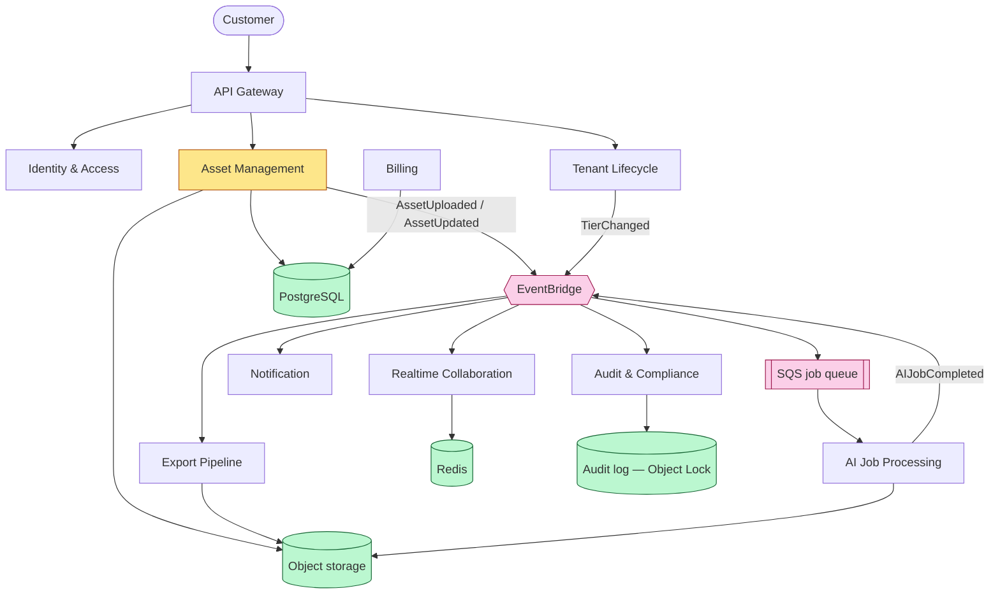
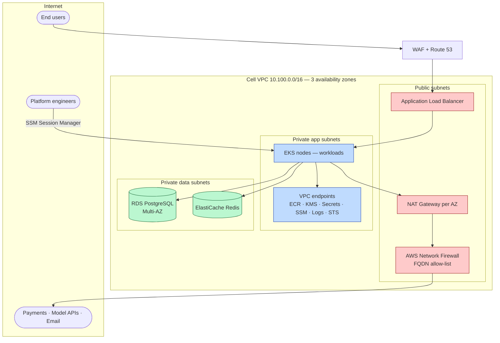

# Acme Platform — Platform Architecture Proposal

**Scope:** production platform architecture for a multi-tenant B2B SaaS product serving three commercial tiers, targeting SOC 2 Type II and GDPR compliance.
**Primary region:** `eu-central-1` · **Reference cell:** `cell-01` · **Public domain:** `platform.example.com`
**Companion artefacts:** `SECURITY.md`, `terraform/`, `charts/billing-service/`, `.github/workflows/deploy.yml`

---

## 1. Executive Summary

Acme Platform stores and processes material that is existentially valuable to its customers: intellectual property, licence agreements and R&D data. This changes the shape of the architecture more than the technology stack does. A competitor losing an hour of availability annoys its users; a customer here who cannot produce a licence chain during an active negotiation or a regulatory audit suffers damage that no SLA credit compensates. Every trade-off in this document resolves in favour of provable integrity over raw speed and in favour of isolation over shared efficiency, and where it does not, the reasoning is stated explicitly.

The platform is organised as **cells**. A cell is a complete vertical slice — network, cluster, data stores, keys — serving either the shared Standard tier or exactly one dedicated customer. Cells do not share compute, data or credentials, and they do not know about one another. This is what makes the blast radius of any single incident equal to one customer rather than the whole fleet, and it is what lets the platform reach 20+ dedicated installations without the operational load growing linearly with them: a new customer is a new cell provisioned from the same code, not a change to shared code.

The application is composed of ten services grouped along domain-driven boundaries: one **core** domain (Asset Management), four **supporting** domains (AI Job Processing, Export Pipeline, Realtime Collaboration, Audit & Compliance) and four **generic** domains (Identity & Access, Tenant Lifecycle, Billing, Notification), fronted by an API Gateway. These boundaries are not documentation-only — they map directly onto Kubernetes namespaces, IAM roles and database schemas, so isolation follows from the domain structure rather than being layered on top of it afterwards. Communication across domain boundaries is event-driven through EventBridge and SQS rather than synchronous, so a failure in AI Job Processing or Export Pipeline degrades a feature instead of blocking asset writes.

The three tiers differ in one dimension — the strength of the isolation boundary — and everything else follows from it:

- **Standard** — shared multi-tenant stack, isolation at the Kubernetes namespace and database row level, public ingress behind WAF. Cheapest per tenant, and honest about it: the shared cluster is a shared blast radius, and the recovery objectives are correspondingly relaxed.
- **Enterprise** — a dedicated cell in a dedicated AWS account per customer, no public ingress, warm standby DR across availability zones.
- **Regulated** — the Enterprise model plus binding data residency: all primary and standby data, backups and logs confined to EU regions, with customer-managed encryption keys.

Two design decisions carry disproportionate weight and are worth stating up front. First, **there are no long-lived credentials anywhere in the platform** — humans authenticate through federated SSO, CI/CD through OIDC, workloads through instance and pod identity. Credential rotation is therefore a property of the mechanism rather than an operational procedure someone has to remember. Second, **audit evidence is written to an account the workload cannot reach**, under S3 Object Lock, because a log that the compromised party can edit proves nothing to an auditor.

---

## 2. Architecture Overview

**Why event-driven between domains.** Asset ingestion is the core revenue path; AI enrichment and export generation are not. If Asset Management called those services synchronously, their availability would become its availability. Publishing an event and returning instead means a queue backlog degrades a feature while the core path keeps working. It also makes the audit trail a first-class consumer: Audit & Compliance subscribes to every event rather than depending on each service remembering to log correctly.

**Why PostgreSQL, Redis and object storage specifically.** Transactional state (assets, entitlements, billing, tenant lifecycle) needs relational guarantees and row-level security, which PostgreSQL provides natively. Redis carries ephemeral state only — cache entries and pub/sub for WebSocket fan-out — and is deliberately never the source of truth, so losing a Redis node is a performance event rather than a data event. Object storage holds documents, export artefacts and the immutable audit log.

---

## 3. A1 — Deployment Models by Tier

### 3.1 Comparison

| | **Standard** | **Enterprise** | **Regulated** |
|---|---|---|---|
| **Typical customer** | SMB | Large enterprise | Finance, luxury, EU-only |
| **Shared** | cluster, RDS, Redis, buckets, platform components | platform components and pipeline code only | platform components and pipeline code only |
| **Isolated** | namespace, DB schema + RLS, bucket prefix, IAM path | AWS account, VPC, EKS cluster, RDS, Redis, buckets, CMK | same as Enterprise, plus region binding |
| **Ingress** | public ALB + WAF, `*.platform.example.com` | private only — PrivateLink or Client VPN, Route 53 private hosted zone, no public endpoint | as Enterprise, all resolved endpoints pinned to EU |
| **Encryption keys** | platform-managed CMK, shared per cell | platform-managed CMK, one per cell | **customer-managed key (BYOK)**, one per cell |
| **DR strategy** | **pilot light** — data continuously replicated, compute provisioned on demand | **warm standby** — scaled-down replica running continuously in a second AZ | **warm standby**, second AZ, plus cross-region copy confined to the EU |
| **Backup retention** | 7 days PITR | 35 days PITR + AWS Backup vault, cross-account | 35 days PITR + cross-account + `eu-west-1` copy |
| **RTO / RPO** | **4 h / 15 min** | **1 h / 5 min** | **1 h / 5 min** |
| **Availability target** | 99.9% | 99.95% | 99.95% |
| **Relative cost per tenant** | 1× | 5–7× | 6–9× |
| **Operational complexity** | low | high — only viable with full automation | highest — adds residency proof and key custody |

### 3.2 How the recovery objectives are actually met

Numbers in a table are worth nothing without the mechanism underneath them, so:

**RPO** is delivered by continuous transaction-log shipping, not by snapshot frequency. PostgreSQL write-ahead logs are archived continuously, which is what makes point-in-time recovery to an arbitrary second possible. The 5-minute figure for dedicated tiers is the archive lag envelope; the 15-minute figure for Standard reflects a less aggressive archive cadence chosen for cost.

**RTO** is delivered by what is already running when the failure happens. Warm standby means a scaled-down but fully functional replica exists, so recovery is a promotion and a scale-up rather than a provisioning exercise — hence one hour. Pilot light means only the data is warm; compute, ingress and platform components are created during the recovery event, which realistically costs four hours even fully automated.

**A note on honesty in these numbers.** A 99.95% target permits roughly 4.4 hours of unavailability per year. A single full DR failover consuming the 1-hour RTO therefore spends about a quarter of the annual budget in one event. That is exactly why §8.4 treats DR drills as a recurring obligation rather than a launch checklist item — an untested recovery path is an assumption, not a capability.

### 3.3 Tier narratives

**Standard.** One EKS cluster serves every SMB tenant, with a namespace per tenant, a `ResourceQuota` and `LimitRange` to contain noisy neighbours, and default-deny `NetworkPolicy` so namespaces cannot reach each other. Data separation is logical: a schema per tenant with PostgreSQL row-level security as a second barrier, an object-storage prefix per tenant with IAM path conditions. This is the cheapest tier both to run and to operate, because there is no per-tenant infrastructure to manage and no per-customer compliance layer. The honest cost is stated as risk R4: logical isolation is a software boundary, and software boundaries fail differently from account boundaries.

**Enterprise.** Each customer receives a dedicated AWS account containing a dedicated cell. Noisy-neighbour risk disappears because there is no neighbour. There is no public endpoint for this tier at all — access reaches the cell through PrivateLink or Client VPN and resolves via a Route 53 private hosted zone, so the tenant's application surface is not addressable from the internet. The complexity of this tier does not come from any single cell being complicated; it comes from running many of them, each potentially pinned to a different version with a different maintenance window. That multiplication is the problem §8 is designed to solve.

**Regulated.** Architecturally identical to Enterprise, with one binding constraint layered on: every primary store, every replica, every backup and every log stays inside EU regions, enforced by Service Control Policies at the organisational unit level rather than by convention. Encryption uses a customer-supplied KMS key, giving the customer a genuine technical ability to revoke Acme's access to their own data. Two consequences deserve to be surfaced to customers rather than buried: some third-party dependencies (model APIs, payment processors) do not offer EU-only guarantees at feature parity, and confining disaster recovery to EU regions narrows the geographic fault-tolerance envelope relative to a globally replicated design.

---

## 4. A2 — Network & Access Model

### 4.1 Network topology

Each cell occupies its own VPC spanning three availability zones. Public subnets contain nothing but the load balancer, the NAT gateways and the network firewall. Every workload and every data store sits in a private subnet with no route to the internet gateway and no public address. Each private subnet has its own route table pointing at the NAT gateway in its own availability zone, so an AZ failure does not remove connectivity from its neighbours and no traffic pays the cross-AZ transit charge.

### 4.2 Access by actor

| Actor | Path | Enforcement |
|---|---|---|
| **End users** | Public ALB on 443 for Standard; PrivateLink or Client VPN for dedicated tiers | WAF managed rule groups plus rate limiting; OIDC authentication at the gateway; dedicated tiers have no public DNS record at all |
| **Platform engineers** | AWS SSM Session Manager only | No public Kubernetes API endpoint, no bastion host, no SSH port open anywhere. `kubectl` reaches the API server through SSM port forwarding, so the connection originates inside the VPC. Every session is recorded in CloudTrail and streamed to the log archive |
| **Customer support** | Read-only role inside one cell account | Isolation is enforced by the **account boundary**, not by a policy condition. A permission granted in one customer's account has no effect in another's — there is no cross-tenant policy to get wrong |
| **Service to service** | Private subnets only | Security-group rules reference other security groups rather than CIDR ranges, so access is granted to a *role* rather than to an address range. In-cluster, default-deny `NetworkPolicy` with explicit allow rules per namespace |

The support access model is worth one extra sentence because it is where most multi-tenant designs go wrong. Attempting cross-tenant isolation through IAM conditions inside a shared account means correctness depends on every policy being written perfectly, forever. Putting each customer in a separate account means correctness depends on the account boundary, which is enforced by AWS and cannot be misconfigured by a bad policy.

### 4.3 Egress control policy

Unrestricted outbound access is the exfiltration path that most compromises actually use, so egress is default-deny and opened deliberately in three layers.

**Layer 1 — AWS service traffic never leaves the AWS network.** A gateway endpoint serves object storage; interface endpoints on PrivateLink serve ECR, KMS, Secrets Manager, SSM, CloudWatch Logs and STS. With private DNS enabled these resolve to in-VPC addresses, so applications call the standard service hostnames unchanged and the traffic simply never reaches the internet. This removes the large majority of outbound volume from the controlled path entirely.

**Layer 2 — security groups restrict protocol and port.** Workload egress is limited to TCP 443, TCP 5432 and DNS. This is a real narrowing from "any protocol, any port", but it is not sufficient on its own, and the reason is worth stating plainly because it drives layer 3: **security groups match IP ranges, not domain names.** An allow-list of hostnames cannot be expressed in a security group.

**Layer 3 — AWS Network Firewall filters by domain.** All remaining outbound traffic transits the NAT gateways and is inspected by stateful rules holding an explicit FQDN allow-list — the payment processor, the model API endpoints, the transactional email provider, the operating-system package mirrors. Everything else is dropped and the drop is logged.

**How the policy is kept honest.** Changing the allow-list is a pull request against the cell's Terraform, so additions are reviewed rather than made in a console. Service Control Policies at the organisational-unit level prevent an internet gateway from being attached to a data subnet or a NAT route from being added out of band. VPC Flow Logs record every accepted and rejected flow, and a rising rate of firewall denials is an alert on the security channel — an application suddenly trying to reach an unapproved host is either a misconfiguration or an intrusion, and both need eyes on them.

---

## 5. A3 — Identity, Secrets & Encryption Keys

### 5.1 Least privilege across three classes of principal

There is no IAM user and no static access key anywhere in the platform. Each class of principal authenticates through a mechanism that issues short-lived credentials:

| Principal | Mechanism | Session | Scope |
|---|---|---|---|
| **Humans** | IAM Identity Center with mandatory MFA, permission sets mapped to organisational units | 1 hour | Read-only by default; write access requires an elevated permission set and is time-boxed |
| **CI/CD** | GitHub OIDC federation | 1 hour, one per workflow run | Trust policy pins the `sub` claim to an exact repository **and** environment, matched with `StringEquals` rather than a wildcard |
| **Workloads** | IRSA — a Kubernetes service account mapped to an IAM role | refreshed automatically | One role per service, scoped to the specific secret ARN, bucket prefix and KMS key it needs |

The OIDC configuration deserves particular attention because it is where this pattern is most commonly implemented insecurely. A trust policy matching `repo:*` allows anyone in the world to create a repository and assume the role; such configurations are found routinely in audits. Pinning the claim to `repo:<org>/<repo>:environment:cell-01` has a second, deliberate consequence: because the same environment name carries required reviewers in GitHub, **the ability to obtain AWS credentials for a production cell is bound to a human approval step**, and the two cannot drift apart.

Duties are separated through role scope rather than through process. The deployment role may push container images but not pull them; the node role may pull but not push. Neither can read a secret belonging to another cell, because the roles exist inside that cell's account.

### 5.2 Secrets

Secrets Manager is the single source of truth. Nothing else stores a secret — not the Helm chart, not the container image, not the Terraform state, not the CI system.

Delivery into the cluster runs through the External Secrets Operator, which reads from Secrets Manager using its own IRSA role and materialises a Kubernetes `Secret`. Pods consume it through `secretKeyRef`, never through a literal environment value in the chart. Refresh is hourly, so a rotation propagates without a redeploy.

Database credentials never pass through the platform at all: RDS-managed password rotation has AWS generate the password, store it and rotate it on a 30-day schedule. There is no value for Terraform to write into state and no value for an engineer to see.

| Secret | Rotation | Owner |
|---|---|---|
| Database master password | 30 days, Secrets Manager managed | automatic |
| Application API keys for third parties | 90 days, Lambda rotation function | automatic |
| KMS key material | 365 days, KMS automatic rotation | automatic |
| CI/CD credentials | per workflow run — none persist | automatic |
| Workload credentials | ~1 hour, refreshed by the identity provider | automatic |
| TLS certificates | ACM managed renewal, 60 days before expiry | automatic |

Every entry rotates without a human procedure. This is a deliberate design property: an operational runbook that depends on someone remembering to act is a control that fails silently the first time that person is on holiday.

### 5.3 Encryption keys and BYOK

Each cell has its own customer-managed KMS key, aliased predictably (`alias/acme-cell-01`), with annual rotation enabled and a key policy granting use only to the roles inside that cell. Every encrypted resource in the cell — database storage, EBS volumes, buckets, snapshots, log groups, the container registry, the secret holding the database password — references that one key. The consequence is a cryptographic blast radius equal to one customer: material from one cell cannot decrypt another's data.

For the Regulated tier the key is supplied by the customer. Implementation is a single indirection: every resource references a computed value that resolves to the platform key by default and to the customer's key ARN when one is configured for that cell. Switching a cell to BYOK is a change to one variable in that cell's parameter file, with no branching in the code.

Key policies grant AWS services access with an `EncryptionContext` condition rather than an unconditional allow, so a shared AWS service cannot be induced to use the key on behalf of a different account — the *confused deputy* pattern.

### 5.4 Break-glass access

Standing administrative access does not exist, but emergency access must, or the first serious incident will produce an improvised one.

| Property | Requirement |
|---|---|
| Eligible operators | Named list of 2–3 engineers, reviewed quarterly |
| Authentication | MFA required by the role's trust policy condition |
| Approval | A second engineer approves out of band before assumption |
| Duration | One-hour session, no extension; re-approval required |
| Detection | CloudTrail alarm fires on assumption of the break-glass role, routed to the security channel, not the SRE channel |
| Follow-up | Mandatory review within 24 hours recording who, why, and every action taken |

The distinction that matters: this is not a permanently open door with a warning sign. It is a closed door with an alarm on it and a required post-incident review, which makes its use rare, visible and auditable.

---

## 6. A4 — Kubernetes & Runtime Platform

### 6.1 Cluster topology by tier

| Tier | AWS account | Cluster | Tenant boundary |
|---|---|---|---|
| Standard | one shared account | one shared EKS cluster | namespace + `ResourceQuota` + `NetworkPolicy` + database RLS |
| Enterprise | one account per customer | one EKS cluster per cell | the account itself |
| Regulated | one account per customer | one EKS cluster per cell | the account plus an SCP restricting usable regions |

Accounts are vended through AWS Organizations and Control Tower into organisational units — `shared-prod`, `enterprise-cells`, `regulated-cells`, `security`, `log-archive`. Service Control Policies act as guardrails that an account administrator cannot override: the `regulated-cells` OU denies any API call outside approved EU regions, and every OU denies disabling CloudTrail or deleting log-archive objects.

The Kubernetes control plane is managed EKS with a private API endpoint and no public access. Node groups run on private subnets; capacity is managed by Karpenter so that a cell scales to its actual demand rather than to a guessed fixed size — relevant when twenty cells each run mostly idle.

### 6.2 Namespace isolation for the shared tier

For Standard, where the boundary is software rather than an account, four controls operate together:

- one namespace per tenant, with `ResourceQuota` and `LimitRange` so a single tenant cannot exhaust node capacity;
- a default-deny `NetworkPolicy` in every namespace, with explicit allow rules — the billing workload accepts ingress only from the API gateway namespace and egresses only to DNS, PostgreSQL and HTTPS;
- one Kubernetes service account per service, mapped through IRSA to an IAM role scoped to that service's own resources, so a compromised pod cannot read another tenant's objects even with valid AWS credentials;
- PostgreSQL row-level security as the last barrier, so a query missing its tenant predicate returns nothing rather than everything.

### 6.3 Platform components

| Component | Purpose |
|---|---|
| AWS Load Balancer Controller | Provisions the ALB from Kubernetes `Ingress` resources |
| cert-manager | Issues and renews TLS certificates automatically |
| External Secrets Operator | Synchronises Secrets Manager into Kubernetes secrets |
| Kyverno | Admission control — enforces the policies below at deploy time |
| OpenTelemetry Collector | Collects logs, metrics and traces uniformly |
| Karpenter | Node provisioning and consolidation |

### 6.4 Baseline hardening

The Pod Security Standard `restricted` profile is enforced at the namespace level, and Kyverno rejects, at admission time, workloads that run as root, request privilege escalation, mount the host filesystem, retain Linux capabilities, or reference an image outside the cell's own registry. Containers run with a read-only root filesystem, all capabilities dropped, `runAsNonRoot`, and the `RuntimeDefault` seccomp profile.

Images are scanned twice — by Trivy in the pipeline before the push, so a critical finding stops the release before the artefact exists in the registry, and by ECR scan-on-push afterwards, so vulnerabilities disclosed after the build are still discovered. The registry uses immutable tags: an approved image cannot be silently replaced under the tag that was approved, which is what makes the change-management evidence in §9 meaningful rather than decorative.

---

## 7. A5 — Data Layer

### 7.1 Placement and encryption

| Store | Standard | Enterprise | Regulated |
|---|---|---|---|
| **PostgreSQL** | shared RDS instance, schema per tenant, RLS enforced | dedicated RDS, Multi-AZ | dedicated RDS, Multi-AZ, EU-pinned |
| **Redis** | shared ElastiCache, key namespace per tenant | dedicated replication group | dedicated replication group, EU-pinned |
| **Object storage** | shared bucket, prefix per tenant with IAM path conditions | dedicated bucket per cell | dedicated bucket, EU-pinned, no replication outside the EU |
| **Encryption at rest** | platform CMK | per-cell CMK | customer-managed key |
| **Encryption in transit** | enforced, not optional — see below | same | same |

Transport encryption is enforced by the stores themselves rather than trusted to clients. PostgreSQL runs with `rds.force_ssl` enabled and rejects unencrypted connections outright; the application connects with `sslmode=verify-full`, which additionally validates the server certificate and therefore defends against redirection, not only against passive interception. Bucket policies carry an explicit `Deny` on any request arriving without TLS — an explicit deny in IAM overrides every allow, so this holds regardless of what any other policy grants.

Redis is treated as disposable by design. It holds cache entries and WebSocket pub/sub state and is never the system of record, which means a Redis failure is a latency event rather than a data-loss event and removes it from the recovery-objective calculation entirely.

### 7.2 Migrating a tenant into a dedicated cell

Tier upgrades are frequent enough to need a defined procedure and dangerous enough to need verification.

1. **Freeze** the tenant's write path at the API gateway; reads continue.
2. **Extract** by `tenant_id` — a logical database dump plus a prefix-scoped object copy.
3. **Load** into the target cell's dedicated stores.
4. **Verify** with row counts per table and checksums over object manifests, compared against the source.
5. **Cut over** DNS and gateway routing to the new cell.
6. **Unfreeze** writes.
7. **Retain** the source data read-only for a defined window before destruction, so a rollback remains possible.

Step 4 is not optional and is not a formality. A migration that completes without verification has not migrated data; it has moved it and hoped. The same reconciliation is reused in the DR failover path (see risk R2), which means it gets exercised regularly rather than being a procedure that only runs during the event it is supposed to protect.

**Downgrades run the same sequence in reverse**, and are not instantaneous. This matters commercially: a customer moving from Enterprise to Standard experiences the same freeze window as one moving up, and their data ceases to live under a customer-controlled key (see risk R5).

### 7.3 Backup, restore and cross-region

Automated backups run with 35-day retention for dedicated tiers and 7 days for Standard, with continuous transaction-log archiving providing point-in-time recovery. Deletion protection is enabled and a final snapshot is mandatory, so a mistaken destroy operation cannot silently discard a customer's data. Automated backups deliberately survive instance deletion.

Snapshots are copied by AWS Backup into a separate account whose vault has Vault Lock applied, so retention cannot be shortened by anyone holding credentials in the workload account — including its administrator.

**Cross-region for the Regulated tier** copies backups to `eu-west-1`, encrypted with a region-local key. The requirement to protect against regional failure and the requirement to keep data in the EU are both satisfiable at once; the mistake to avoid is treating them as opposed and abandoning geographic redundancy altogether. An SCP on the `regulated-cells` OU denies any API call outside approved EU regions, so residency is enforced by the organisation rather than by the correctness of each individual Terraform file.

Restores are verified, not assumed — see §8.4.

---

## 8. A6 — CI/CD & Release Strategy

### 8.1 Build once, promote by digest

An artefact is built exactly once, from a commit on the main branch, and promoted unchanged through every environment and every cell. Promotion references the image **digest**, not a tag: a tag is a mutable pointer, a digest is the content itself. Combined with immutable tags in the registry, this makes it verifiable that the image running in `cell-17` is bit-for-bit the artefact that passed scanning and review.

The pipeline runs static analysis (dependency audit, infrastructure scanning, chart linting), then build, then a Trivy scan that fails the run on critical findings **before** the push, then the push, then deployment. Ordering is deliberate: scanning after publication means a vulnerable artefact already exists where something could pull it.

### 8.2 Rolling out across 20+ cells

Deploying to twenty-one independent installations one at a time does not scale, and deploying to all of them at once removes the safety of independence. Releases therefore move in waves:

| Wave | Target | Gate |
|---|---|---|
| 0 | internal staging cell | automated end-to-end suite |
| 1 | shared Standard tier, canary at 10% of pods | error rate and p99 latency within threshold over a 30-minute window |
| 2 | Standard tier at 100% | 2 hours of steady-state metrics |
| 3 | two pilot Enterprise cells | 24 hours, plus explicit approval |
| 4 | remaining cells in batches of 25% / 50% / 100% | thresholds per batch, automatic halt on breach |

Canary promotion is gated on defined error-rate and latency thresholds measured over a fixed window, not on an engineer judging that things look fine. This converts each stage into an auditable, criteria-based decision — which is what makes it usable as SOC 2 change-management evidence rather than merely good practice.

Customers who contractually pin a version are handled by a per-cell version field in that cell's parameter file. There is no branch per customer and no conditional in the application code; a pinned cell simply stops receiving new waves until its pin is updated.

### 8.3 Rollback

Three mechanisms, in increasing order of severity. Helm deploys with `--atomic`, so a release that fails its readiness checks reverts automatically without human involvement. A completed release that misbehaves later is reverted by redeploying the previous digest — available immediately, because immutable tags guarantee it still exists unchanged. A database migration that cannot be rolled forward is handled by the expand-and-contract pattern: schema changes are additive and backward-compatible for at least one release, so the application can be reverted without the schema having to follow.

### 8.4 Disaster-recovery drill procedure

An untested recovery path is an assumption. Drills therefore run on a schedule and produce artefacts.

**Nightly, non-disruptive.** An automated job restores the most recent backup of one rotating cell into an isolated environment, runs schema and row-count validation, measures the achieved RPO against the target, and destroys the environment. Production traffic is untouched. Failure pages the on-call engineer.

**Quarterly, full failover.** One Enterprise cell performs a real end-to-end cutover to its warm standby during a pre-announced low-traffic window: promote the standby, run the §7.2 reconciliation, switch DNS, run the smoke suite, and record the achieved RTO. The cell then continues on the promoted infrastructure rather than switching back, which proves the promoted environment is genuinely production-capable rather than merely reachable.

**Annually, region loss.** A tabletop exercise covering the loss of `eu-central-1`, including the Regulated-tier constraint that recovery must land in the EU.

Every drill produces a dated report with measured RTO and RPO against target. These reports are the A1 availability evidence in §9.

---

## 9. A7 — Observability & SOC 2 Evidence

### 9.1 Telemetry

**Logs.** Applications emit structured JSON to stdout; the OpenTelemetry Collector ships them to CloudWatch Logs with a tenant identifier attached. Operational logs are retained 30 days. **Security and audit logs are separate** — CloudTrail, VPC Flow Logs, S3 access logs, RDS connection logs and Kubernetes audit logs are delivered to a dedicated `log-archive` account, stored under S3 Object Lock in compliance mode with 12-month retention.

That separation is the point rather than a filing convention. An attacker who compromises a cell account holds credentials in that account only; the log archive is in an account they cannot reach, under a lock that prevents deletion even by the account root. A log the compromised party can edit is not evidence.

**Metrics.** Prometheus in-cluster, remote-written to Amazon Managed Prometheus, with tenant labels on the shared tier so per-tenant consumption is measurable for both capacity planning and cost allocation.

**Traces.** OpenTelemetry instrumentation propagating context across the asynchronous hops — upload to AI job to export — so a failure can be traced to its originating request instead of surfacing as an unrelated error in a downstream service. Sampled at 10% with tail-based sampling retaining all error traces.

### 9.2 Alerting

Security alerts and performance alerts go to different channels and different rotations. Failed authentications, IAM policy changes, break-glass assumption, GuardDuty findings and firewall-deny rate increases reach a security channel; latency, error rate and saturation reach the SRE channel. Mixing them means access anomalies are read as noise by an engineer who is looking for a performance problem — which is precisely how a slow intrusion goes unnoticed.

Log retention and access are themselves controlled: read access to the archive is a separate permission set, and reading it is logged.

### 9.3 SOC 2 control mapping

| Control | Implementation | Evidence artefact |
|---|---|---|
| **CC6** — Logical and physical access | Federated SSO with MFA; OIDC for CI/CD; IRSA for workloads; no long-lived credentials; support isolation by account boundary; security-group rules referencing groups rather than CIDRs; default-deny `NetworkPolicy` | CloudTrail `AssumeRole*` events; Identity Center assignment reports; break-glass activation records; S3 access logs; VPC Flow Logs |
| **CC7** — System operations and monitoring | Flow logs at `ALL` traffic type; GuardDuty; separate security alerting channel; image scanning in pipeline and registry; infrastructure scanning with justified suppressions; distributed tracing across async hops | Immutable audit logs under Object Lock; GuardDuty finding history; pipeline run history; scanner reports with suppression rationale |
| **CC8** — Change management | All infrastructure in Terraform with encrypted, versioned, locked remote state; deployment gated by a GitHub Environment with required reviewers, bound to the OIDC trust policy; immutable image tags; threshold-gated canary promotion; automatic rollback | Pull request history; deployment markers correlated with metrics; canary promotion records; rollback events; `log_statement = ddl` records of every schema change |
| **A1** — Availability | Multi-AZ across three zones; warm standby for dedicated tiers; PITR with continuous log archiving; cross-account backup vault with Vault Lock; scheduled DR drills | Uptime metrics against target; nightly restore-validation reports; quarterly failover reports with measured RTO/RPO; migration reconciliation records |

### 9.4 SOC 2 Type II timing

A Type II report requires an observation window — typically six to twelve months — over which controls are demonstrated to have operated effectively, not merely to exist. Evidence collection against this mapping therefore begins in Phase 0/1, even though several Regulated-tier controls (BYOK, residency enforcement) do not land until Phase 3. Deferring collection until the last control is implemented would push the earliest achievable report out by two full phases for no architectural reason.

---

## 10. A8 — Enterprise Customer Onboarding Runbook

| # | Step | Owner | Output | Target |
|---|---|---|---|---|
| 1 | Contract signed; tier, region and residency requirements recorded | Sales / Legal | Cell request ticket with tier, region, BYOK flag | day 0 |
| 2 | Account vended into the correct OU via Control Tower; SCPs applied | Platform | New AWS account, guardrails active | day 1 |
| 3 | Cell provisioned — `./provision-cell.sh --customer-id <id> --aws-region <region> --tier enterprise` | Platform | VPC, cluster, data stores, KMS key, IAM roles; audit log of the run | day 1 |
| 4 | For Regulated: customer key imported, key policy scoped to cell roles | Platform + customer | BYOK active, residency SCP verified | day 2 |
| 5 | DNS delegated; ACM certificate issued; private hosted zone associated; PrivateLink or Client VPN endpoint published | Platform | `<customer>.platform.example.com` resolving privately | day 2 |
| 6 | Application deployed at the customer's pinned version | CI/CD | Release recorded against the cell | day 3 |
| 7 | Smoke and acceptance suite executed | Platform | Signed test report | day 3 |
| 8 | Security review — scanner clean or suppressions justified; egress allow-list confirmed against the customer's integrations | Security | Cell security sign-off | day 4 |
| 9 | DR drill executed once against the new cell before go-live | Platform | Measured RTO/RPO against target | day 4 |
| 10 | Support handoff — runbook, escalation path, scoped read-only role issued to support | Platform → Support | Support enablement record | day 5 |
| 11 | Go-live; cell enters the standard rollout waves | — | Cell in fleet inventory | day 5 |

**Ongoing.** The cell joins wave 3 or 4 of the release schedule, participates in the nightly restore-validation rotation, and its cost and drift are reported monthly. Configuration drift is detected by a scheduled `terraform plan` that alerts on any difference between declared and actual state.

**Offboarding.**

| # | Step | Output |
|---|---|---|
| 1 | Termination notice; retention obligations confirmed against contract and law | Deletion plan with dates |
| 2 | Final data export delivered in an agreed portable format | Export manifest with checksums |
| 3 | Grace period observed — data retained read-only, access revoked | Access revocation record |
| 4 | Workloads destroyed; data stores destroyed with a final snapshot retained per the deletion plan | Terraform destroy log |
| 5 | KMS key scheduled for deletion after the 30-day waiting period | Key deletion record |
| 6 | Audit logs retained in the log archive for the full 12-month window — **not** deleted with the cell | Retention justification |
| 7 | Account closed; certificate of deletion issued to the customer | Signed deletion certificate |

Step 6 is the one that requires explanation to customers. Audit logs proving what happened during the relationship must outlive the relationship, or the SOC 2 evidence chain has a hole exactly where a dispute is most likely. Personal data within those logs is handled by the pseudonymisation mechanism in risk R1 rather than by deleting the records.

---

## 11. Top 5 Risks & Trade-offs

### R1 — Immutable audit logs versus the GDPR right to erasure

**Likelihood** high · **Impact** high · **Status** mitigated by design

Object Lock is what makes audit logs valid evidence under CC7 — an immutable log cannot be forged after the fact. The same property means an Article 17 erasure request cannot be honoured for a data subject referenced inside one. The two requirements are in genuine tension, not merely apparently so.

*Mitigation.* Immutable logs record a pseudonymous subject identifier only. The mapping from pseudonym to identity lives in a separate, non-locked store owned by the Identity & Access domain. A standard erasure request is satisfied by deleting the mapping row, which makes the corresponding log entries permanently unlinkable to a person without altering the immutable record. Where a record is under legal hold or active investigation, Articles 17(3) and 18 apply instead: the mapping is flagged and deliberately retained, restricting processing rather than erasing. **That hold check must sit in front of the deletion pipeline as an automated gate**, not as a manual exception someone is trusted to remember.

### R2 — Fast promotion versus verified promotion during failover

**Likelihood** medium · **Impact** critical · **Status** accepted with a deliberate inversion

Warm standby is sold on recovery time, and the instinct is to promote the replica as fast as possible. For this domain that instinct is backwards. Asynchronous replication lag means a fast promotion can cut over to a replica that has not fully caught up, and for licence agreements and IP provenance an incomplete record silently becoming the new source of truth is worse than an additional twenty minutes of downtime — the outage is visible and recoverable, the corrupted provenance chain may not be discovered until it matters in court.

*Decision.* The default failover path runs the same checksum and row-count reconciliation used in tenant migration (§7.2) before a promotion is considered complete. This costs measurable RTO and is the reason the target is one hour rather than fifteen minutes. Reusing the migration reconciliation means the code path is exercised regularly rather than only during the emergency it exists for.

### R3 — Migration freeze windows scale worst for the customers who tolerate them least

**Likelihood** high · **Impact** medium · **Status** partially mitigated

Every tier change puts the tenant's write path into a freeze window while data is extracted, loaded and verified. The window is scoped to the moving tenant and does not affect the platform, but it scales with data volume — and the customers large enough to justify a dedicated cell are precisely those with the most data and the least tolerance for write downtime. Realtime Collaboration degrades particularly badly: WebSocket sessions do not pause gracefully, they drop.

*Mitigation.* Move the bulk of the data ahead of the freeze through continuous logical replication, so the freeze covers only the final delta and shrinks from hours to minutes. Schedule migrations in the customer's agreed low-traffic window. Have the realtime client reconnect with backoff and replay from its last acknowledged sequence rather than treating a disconnect as a session end. Residual risk remains, and it is disclosed to the customer during migration planning rather than discovered by them.

### R4 — Shared blast radius on the Standard tier

**Likelihood** medium · **Impact** high · **Status** accepted, priced

Standard's cost advantage exists because one cluster serves every SMB tenant. A platform-level defect, a Kubernetes CVE or a container-escape scenario therefore has a far larger blast radius than in the dedicated tiers, even with default-deny network policies, namespace quotas and row-level security. Those are software boundaries, and software boundaries fail differently from account boundaries: a policy can be misconfigured, an account boundary cannot.

*Mitigation and honesty.* Defence in depth — `restricted` Pod Security, admission control, IRSA scoping, RLS — reduces the probability but does not change the topology. This is the direct cost of the cost/isolation trade-off stated in §3, and customers whose risk tolerance does not accommodate it should be sold Enterprise rather than reassured about Standard. Standard is on a shorter patch SLA than the dedicated tiers for exactly this reason.

### R5 — Customer-managed key lifecycle cuts both ways

**Likelihood** low · **Impact** critical · **Status** mitigated by procedure

BYOK exists so a Regulated customer can revoke Acme's access to their data. That capability is the feature, and it is also the risk: a customer's own key-management error — a disabled key, a deleted key, a broken key policy — renders their data unreadable through no platform fault. This must be covered by a support runbook that treats it as a customer-side incident rather than a platform SLA breach, with the distinction agreed contractually in advance instead of argued during the outage.

The reverse case is easier to overlook and just as important. When a Regulated or Enterprise customer downgrades to Standard, their data moves into shared stores, which are necessarily encrypted under the platform's own key — a shared database cannot be encrypted with one tenant's customer-managed key. **A downgrade therefore silently reduces the protection level on data the customer originally paid to protect more strongly.** That consequence is surfaced explicitly during downgrade planning and requires written acknowledgement; it is not an implementation detail.

---

## 12. Implementation Roadmap

| Phase | Scope | Exit criteria |
|---|---|---|
| **0 — Platform foundations** | AWS Organizations, Control Tower, OU structure and SCPs; network baseline (three-AZ VPC, NAT, VPC endpoints, Network Firewall, WAF); OIDC-based CI/CD; IAM and IRSA model; shared EKS cluster with `restricted` Pod Security, Kyverno admission control and image scanning; platform components (ingress, cert-manager, external-secrets); log-archive account with Object Lock | A tenant-less cluster passes baseline hardening checks; CI/CD deploys with no long-lived credentials; CloudTrail and flow logs land in the archive account |
| **1 — Standard tier GA** | Ten services on the shared cluster with namespace-per-tenant; EventBridge and SQS backbone; RDS, ElastiCache and object-storage data layer with RLS; canary release pipeline; baseline observability | First paying Standard tenants live; canary promotion gated by defined thresholds rather than manual sign-off; per-tenant metrics available |
| **2 — Enterprise tier and onboarding automation** | Account vending; dedicated-cell provisioning pipeline (`provision-cell.sh`); private ingress via PrivateLink or Client VPN; warm standby DR per cell; tenant migration flow (freeze, extract, verify, cut over); 3–5 pilot cells | A pilot cell survives a complete onboarding cycle end to end, including one successful DR drill and one verified tenant migration |
| **3 — Regulated tier and SOC 2 readiness** | BYOK/CMEK; EU residency enforced by SCP; immutable audit logging operationalised; break-glass process; security alerting split from performance alerting; evidence collection automated | Evidence collection begins for the Type II observation window; first Regulated cell live with a customer-supplied key |
| **4 — Fleet scale-out** | Wave-based rollout across a growing cell count; nightly and quarterly DR drills operationalised; per-cell cost and drift reporting; offboarding and deletion-certificate flow | Platform sustains 20+ dedicated cells without release cadence or on-call load growing linearly with cell count |

**Sequencing rationale.** Standard ships first because it lets the core patterns — service boundaries, the event backbone, the data layer — be built and validated once, cheaply, on shared infrastructure, before being replicated across dozens of dedicated installations. Enterprise follows specifically to prove out the dedicated-cell and onboarding machinery itself, which is the part that determines whether the platform scales operationally. Regulated is sequenced after Enterprise rather than in parallel because it layers compliance constraints onto a cell model that should already be proven; adding residency and key custody to an unproven model means debugging two problems as one. Fleet scale-out is its own phase because the risks it raises appear only once cell count is high enough for them to appear.

---

## Appendix A — Relationship to the Part B Repository

The hardening exercise in Part B implements one slice of this design — the `cell-01` Enterprise cell running the `billing-service` workload. Where the two diverge, it is because the starter repository fixes certain choices, and those divergences are recorded rather than glossed over.

| Area | This proposal | Part B repository | Reason |
|---|---|---|---|
| Control plane | Managed EKS, private endpoint, multi-AZ | Single-node k3s on EC2 | The starter repository provides k3s as a control-plane placeholder. It was hardened rather than replaced, since swapping the platform is outside the exercise. The trade-off is real: k3s on one node is a single point of failure and cannot be patched without downtime |
| Engineer access | SSM Session Manager | SSM Session Manager | Implemented as designed; no SSH port is open and there is no bastion |
| Egress filtering | Network Firewall with an FQDN allow-list | Security groups narrowed to TCP 443, 5432 and DNS | Security groups cannot match domain names. The narrowing is implemented; the domain-level layer is designed but not deployed. Recorded as risk R2 in `SECURITY.md` |
| Event backbone | EventBridge and SQS | not present | The starter repository contains a single service; the backbone is a platform-level concern outside its scope |
| Log storage | Separate `log-archive` account, Object Lock | CloudWatch and S3 within the cell account | Cross-account log archiving requires an organisation that does not exist in the exercise. Recorded as risk R3 in `SECURITY.md` |
| Workload identity | IRSA | EC2 instance profile | IRSA requires EKS. The instance profile is the equivalent mechanism for the k3s placeholder — in both cases no static credential exists |
| Encryption | Per-cell CMK, BYOK for Regulated | Per-cell CMK with a BYOK variable | Implemented as designed; supplying a customer key ARN switches the whole cell |

---

*Confidential — prepared for the Acme Platform Platform Engineering assessment. All names, identifiers and domains are placeholders.*
